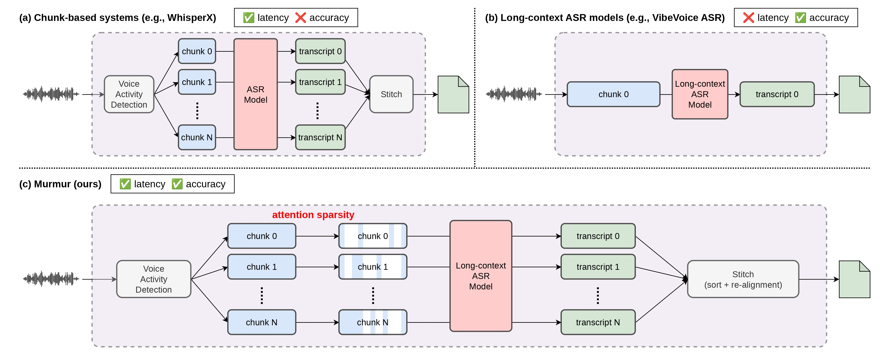

# Murmur: An Efficient Inference System for Long-Form ASR

[](https://arxiv.org/abs/2606.01483)

---

## Updates
**2026/6/1** - [Preprint](https://arxiv.org/abs/2606.01483) is released on arXiv


## Introduction
Long-form automatic speech recognition demands both accuracy and low latency, yet existing approaches force a trade-off between the two. Chunk-based pipelines enable low latency but sacrifice cross-chunk context and rely on fragile boundary heuristics for speaker and timestamp alignment. Long-context models achieve superior accuracy in a single pass but are an order of magnitude slower.

Murmur resolves this tension through two complementary optimizations:
- **Inter-chunk scheduling:** We treat chunk size as a tunable hyperparameter rather than minimizing it for latency, and find that intermediate chunk sizes achieve a better accuracy-latency trade-off for modern long-context ASR models.
- **Intra-chunk efficiency:** We observe that attention in long-context ASR models is largely local, and exploit this structure via a sliding window KV cache eviction policy applied to both output and speech tokens, reducing per-chunk computation.

## Architecture

*Comparison of three ASR system designs: chunk-based pipelines, long-context single-pass models, and Murmur. Murmur occupies the middle ground, achieving competitive accuracy while maintaining low latency.*

## Quick Start

### 1. Create an environment

```bash
conda create -n murmur python=3.10 -y
conda activate murmur
```

### 2. Install

Clone the repo and install Murmur (and its dependencies) with `pip`:

```bash
git clone https://github.com/rubywtl/Murmur.git
cd Murmur
pip install -e .
```

### 3. Run a benchmark

Benchmarks run a VibeVoice ASR model on a long-form dataset and report accuracy
(WER/CER, and cpWER/tcpWER/DER where speaker labels exist) plus inference stats.
The dataset is downloaded automatically from the Hugging Face Hub on first run.

```bash
python benchmarks/benchmark.py \
    --dataset ami_ihm \
    --mode chunked \
    --batch_size 8 \
    --output_dir ./outputs/benchmark
```

Common options:

| Flag | Description | Default |
| --- | --- | --- |
| `--model_path` | VibeVoice model — HF hub ID or local path | `microsoft/VibeVoice-ASR` |
| `--dataset` | `ami_ihm`, `ami_sdm`, `tedlium3`, `asr_lb_earnings21` | `ami_ihm` |
| `--mode` | `baseline`, `chunked`, or `both` | `chunked` |
| `--device` | Inference device | `cuda` |
| `--batch_size` | Chunks decoded per batch | `8` |
| `--max_chunk_s` | Max chunk length(s) in seconds | `300` |
| `--output_dir` | Where transcripts and results are written | `./outputs/benchmark` |
| `--hf_token` | Hugging Face token (for gated datasets) | — |

## Acknowledgements

`murmur/modeling/vibevoice/` contains code vendored and adapted from Microsoft's
[VibeVoice](https://github.com/microsoft/VibeVoice), used under the MIT License.
See the `LICENSE` and `NOTICE` files in that directory for details.

